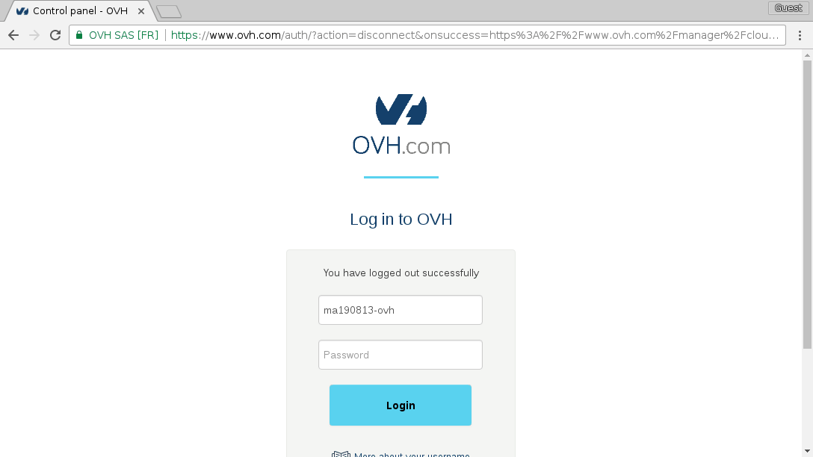
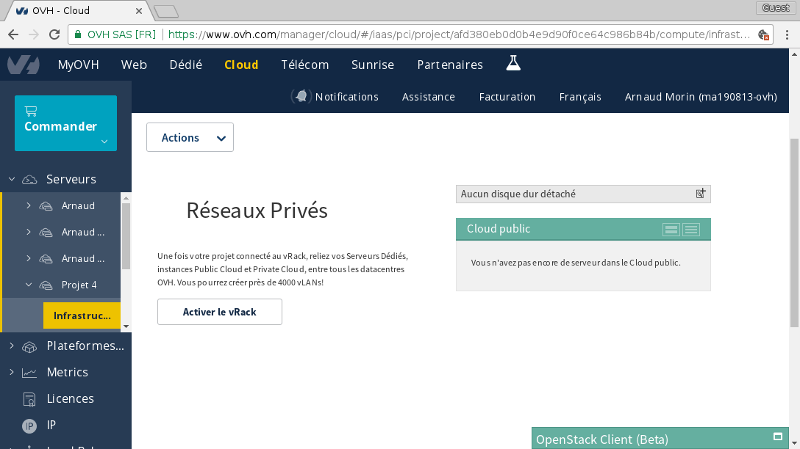
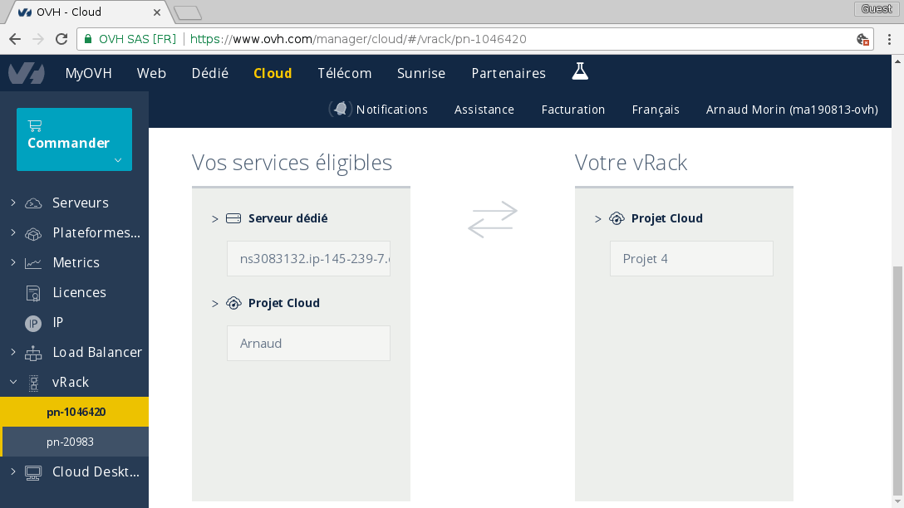
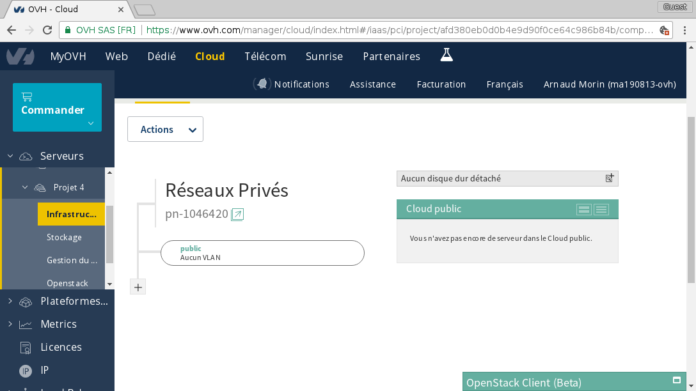
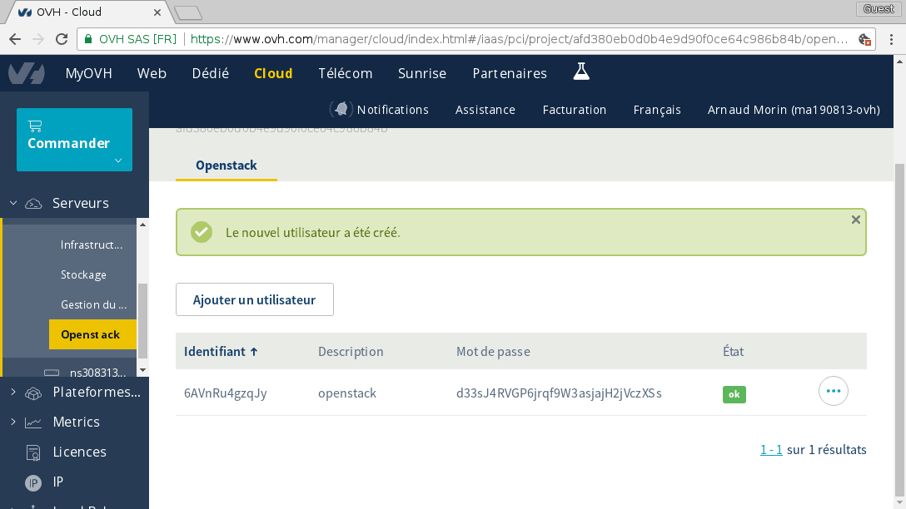

   * [Introduction](#introduction)
      * [Objective](#objective)
      * [Architecture](#architecture)
   * [Prepare your environment](#prepare-your-environment)
      * [Create your OVH account](#create-your-ovh-account)
      * [Create a cloud project](#create-a-cloud-project)
      * [Activate vRack on your cloud project](#activate-vrack-on-your-cloud-project)
      * [Link your project to this new vRack](#link-your-project-to-this-new-vrack)
      * [Create the subnets](#create-the-subnets)
      * [Create an OpenStack user](#create-an-openstack-user)
      * [Download openrc file](#download-openrc-file)
      * [Order a /28 failover IP block](#order-a-28-failover-ip-block)
   * [Bootstrap](#bootstrap)
      * [Clone this repo](#clone-this-repo)
      * [Install openstack client](#install-openstack-client)
      * [Source openrc file](#source-openrc-file)
      * [Run bootstrap script](#run-bootstrap-script)
   * [Deploy](#deploy)
      * [Connect to deployer](#connect-to-deployer)
      * [Ansible](#ansible)
         * [Configure dynamic inventory file](#configure-dynamic-inventory-file)
         * [Check that the dynamic inventory works](#check-that-the-dynamic-inventory-works)
         * [deployer](#deployer)
         * [rabbit](#rabbit)
         * [mysql](#mysql)
         * [keystone](#keystone)
         * [glance](#glance)
         * [nova](#nova)
         * [neutron](#neutron)
         * [horizon](#horizon)
         * [compute](#compute)
         * [nova](#nova-1)
         * [All in one shot](#all-in-one-shot)
   * [Configure](#configure)
      * [Keystone](#keystone-1)
         * [Populate your OpenStack with default values](#populate-your-openstack-with-default-values)
      * [Horizon](#horizon-1)
   * [Enjoy](#enjoy)


# Introduction
## Objective

Main objective is to create an small OpenStack infrastructure within an OVH public cloud infrastructure (which is also run by OpenStack by the way :p So we will create an OpenStack over OpenStack).

## Architecture
```
             ssh       +----------+
you     +----------->  | deployer |
                       +----------+
                            |
                        ansible (ssh)
                            |

+----------+   +----------+   +----------+         +---+
|  rabbit  |   |   nova   |   |  neutron | <-----> | V |
+----------+   +----------+   +----------+         | R |
                                                   | a |
+----------+   +----------+   +----------+         | c |
|  mysql   |   |  glance  |   |  compute | <-----> | k |
+----------+   +----------+   +----------+         +---+
                                                     |
+----------+   +----------+                          |
|  horizon |   | keystone |                          |
+----------+   +----------+                          |
                                          Instances public access
             |                             with /28 network block
       HTTP API access                               |
             |                                       |
             +----------+----------------------------+
                        |
                    Internet

```

Every machine will have a public IP and be accessible from internet.

They will also be connected to each other with a management network.

Neutron and compute will also be connected to a special network through vRack.

In this vRack we will route a failover IP block (/28 in my example) so that we can give public IPs to instances / routers.

Deployer is used to configure the others (like an admin / jumphost machine).

# Prepare your environment
To start working on this project, you must have:
 - an account on OVH
 - a cloud project
 - a vRack

## Create your OVH account
See here:
https://www.ovh.com/fr/support/new_nic.xml

## Create a cloud project



## Activate vRack on your cloud project


## Link your project to this new vRack



## Create the subnets
You must create two subnets:
 - one with a VLAN ID (you choose, don't care) named **management** and **DHCP enable**
 - one without any VLAN ID named **public** and **DHCP disabled**

Respect the names as we refer to them within the bootstrap script.

Example of creation of the management network from CLI:

```sh
$ openstack network create management
$ openstack subnet create --dhcp --gateway none --subnet-range 192.168.1.0/24 --network management 192.168.1.0/24
```

Example of creation of the public network from manager:



## Create an OpenStack user



## Download openrc file



## Order a /28 failover IP block

To do that, you can run the script data/order_ip_block.py
```sh
$ python3 order_ip_block.py
Please pay the BC 12345678 --> https://www.ovh.com/cgi-bin/order/displayOrder.cgi?orderId=12345678&orderPassword=ABCD
Done
```

Once your BC (Bon de Commande / order) is paid, you should receive a /28 in your manager. You can now move this pool of IP in your vRack by doing so:


# Bootstrap
## Clone this repo
```sh
$ git clone https://github.com/arnaudmorin/bootstrap-openstack.git
$ cd bootstrap-openstack
```

## Install openstack client
```sh
$ pip install python-openstackclient
```

## Source openrc file
```sh
$ source openrc.sh
```

## Run bootstrap script
```sh
$ ./bootstrap.sh
```

This will create 9 instances, connected to an external network (Ext-Net) and two vRack networks (public and management).

Each instance is going to be dedicated to one of the core OpenStack services (see architecture).

You will also have a special instance named deployer which you will use as jump host / ansible executor.

Wait for the instances to be ACTIVE.
You can check the status with:

```sh
$ openstack server list
```

# Deploy
## Connect to deployer
Now that your infrastructure is bootstrapped, you can start the configuration of OpenStack itself from the deployer machine.

To do so, you will need to connect to the deployer with the SSH key (named _zob_) that was created during bootstraping:

```sh
$ chmod 600 data/zob.key                    # Because permissions of the key were too loose when you cloned this repo.
$ ssh -i data/zob.key ubuntu@deployer_ip    # Replace deployer_ip with the real IP.
```

Now that you are inside the deployer, be root
```sh
$ sudo su -
```

## Cloud-init and postinstall

Behind the scene, the bootstrapping created the instances with custom **cloud-init** scripts (from [userdata](userdata)). Those scripts are executed as postinstall inside the machine at boot time.

As the execution of this postinstall can take some time (few minutes), if you are SSHing to your machine quite quickly, you can check the postinstall logs in live:

```sh
$ tailf /var/log/postinstall.log
```

The postinstall is finished when you can read _done_ at the end.


## Ansible
### Configure dynamic inventory file
Ansible is using a dynamic inventory file that will ask openstack all instances that you currently have in your infrastructure.
A config file should already be configured in /etc/ansible/openstack.yml
You can check its content and update if necessary

### Check that the dynamic inventory works
```sh
$ /etc/ansible/hosts --list
```

should return something ending like:
```
...
  "ovh": [
    "horizon",
    "mysql",
    "compute-1",
    "neutron",
    "glance",
    "nova",
    "keystone",
    "rabbit",
    "deployer"
  ]
}
```

### deployer
Run ansible on deployer itself, so it can learn the different IP addresses of your infrastructure.
```sh
$ ansible-playbook /etc/ansible/playbooks/deployer.yml
```

### rabbit
Continue with rabbit
```sh
$ ansible-playbook /etc/ansible/playbooks/rabbit.yml
```

### mysql
Then mysql
```sh
$ ansible-playbook /etc/ansible/playbooks/mysql.yml
```

### keystone
Then keystone
```sh
$ ansible-playbook /etc/ansible/playbooks/keystone.yml
```

### glance
Glance is one of the easiest service to install, so try to install it by your own.

To do so, you can read the documentation here: https://docs.openstack.org/glance/pike/install/index.html

Or, if you are eager to get to the end of this boostraping, you can use:

```sh
$ ansible-playbook /etc/ansible/playbooks/glance.yml
```

### nova
Then nova
```sh
$ ansible-playbook /etc/ansible/playbooks/nova.yml
```

### neutron
Then neutron
```sh
$ ansible-playbook /etc/ansible/playbooks/neutron.yml
```

### horizon
Then horizon
```sh
$ ansible-playbook /etc/ansible/playbooks/horizon.yml
```

### compute
And finally, compute
```sh
$ ansible-playbook /etc/ansible/playbooks/compute.yml
```

### nova
Then nova again, to register the compute in nova cell
```sh
$ ansible-playbook /etc/ansible/playbooks/nova.yml
```

### All in one shot
Or if you want to perform all in one shot:
```sh
$ for s in deployer rabbit mysql keystone glance nova neutron horizon compute nova ; do ansible-playbook /etc/ansible/playbooks/$s.yml ; done
```

# Configure
## Keystone
On keystone server, you will find the openrc_admin and openrc_demo files that can be used to access your brand new OpenStack infrastructure
You will also find a helper script that contains basic functions to create images, networks, keypair, security groups, etc.

### Populate your OpenStack with default values

From your keystone node, as root:
```sh
# Source helper functions
source helper

# Following actions are done as admin
source openrc_admin
create_flavors
create_image_cirros
create_image_ubuntu
# Before running this one, adjust the parameters with your network settings
create_network_public 5.135.0.208/28 5.135.0.222

# Following actions are done as demo
source openrc_demo
create_network_private
create_rules
create_key
create_server_public
```

## Horizon
You can also browse the dashboard by opening url like this: http://*your_horizon_ip*/horizon/

# Enjoy

